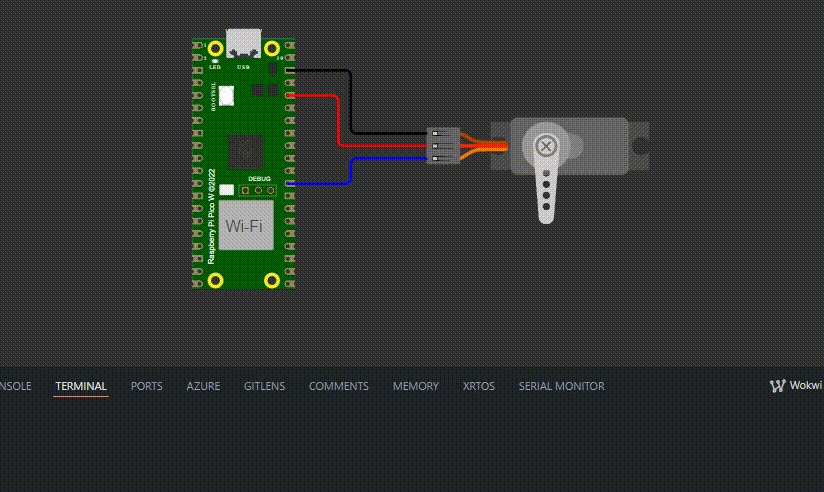

# Controle de Servo Motor e LED via PWM

## 📝 Sobre o Projeto

Este programa utiliza o Raspberry Pi Pico para controlar um servomotor por meio de um sinal PWM (Pulse Width Modulation). O servo é movimentado para três posições iniciais (180°, 90° e 0°) e, em seguida, oscila suavemente entre 0° e 180° continuamente.

## 🎯 Funcionalidades

1. O servo motor está conectado ao GPIO 22 e é controlado via PWM.
2. O sistema movimenta suavemente o servo motor entre 0° e 180° continuamente.
3. Move o servo para três posições fixas: 180°, 90° e 0°, com um intervalo de 5 segundos entre cada movimento.
4. Inicia uma movimentação suave e contínua do servo entre 0° e 180°, ajustando gradualmente o ciclo de trabalho do PWM.

## 📂 Estrutura do Projeto

O projeto é composto pelos seguintes arquivos principais:

- `pwm-servomotor.c`: Contém a lógica principal para controlar o servo motor e o LED.
- `CMakeLists.txt`: Arquivo de configuração do CMake para compilação do projeto.
- `diagram.json`: Arquivo utilizado para simular o hardware.

## 🛠️ Requisitos

- Raspberry Pi Pico W
- 01 LED RGB (Azul - GPIO 12)
- Servo Motor (WOKWI)
- SDK do Pico instalado
- CMake
- Compilador compatível com C e C++

## 🔎 Observação

Caso queira usar o LED RGB interno da placa no lugar do servo, basta substituir:

```
#define PWM_SERVO 22
```

por

```
#define PWM_SERVO 12
```

No entanto, ao substituir pelo LED interno da placa, é possível observar variações na intensidade da iluminação, pois o sinal PWM afeta seu brilho de maneira análoga ao controle de um servomotor.

## ⚙️ Compilação e Execução

1. Clone o repositório do projeto:

   ```sh
   git clone https://github.com/thalissoncastrog/embedded-system-one-shot-timer.git
   cd embedded-system-pwm
   ```

2. Abra esse projeto no vscode e ele irá criar a pasta build.

3. Após isso, basta compilar o código e executá-lo acessando o arquivo `diagram.json`.

## 🎯 Resultado

- Servo motor:
  

## 👥 Colaboradores

1. **Adão Thalisson Castro Guimarães** - [GitHub](https://github.com/thalissoncastrog)

## 🎥 Vídeo Ensaio

- `Link`: [https://youtube.com/shorts/FaAHct1es9M?feature=share](https://youtube.com/shorts/FaAHct1es9M?feature=share)

## 📜 Licença

Este projeto está licenciado sob a Licença MIT. Para mais detalhes, consulte o arquivo LICENSE.
